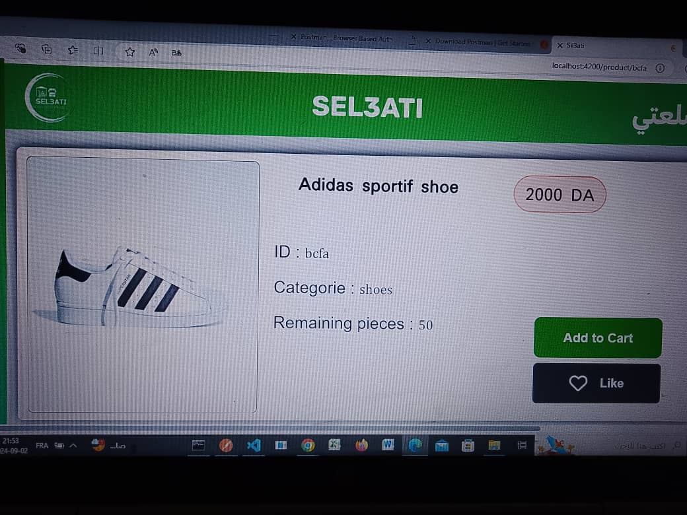
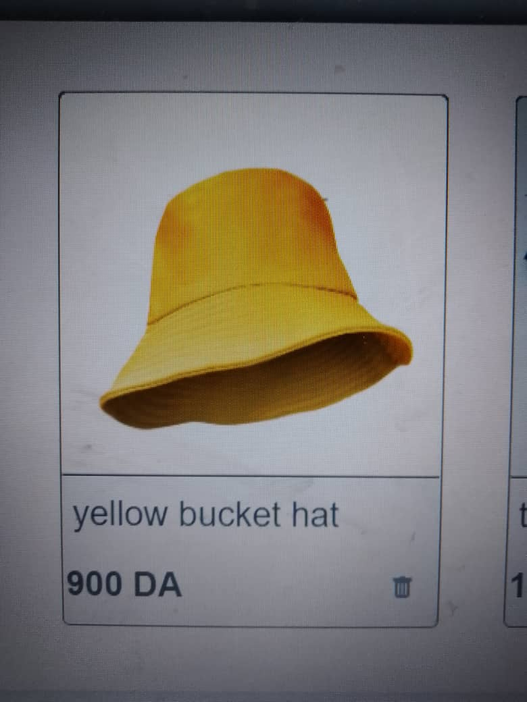
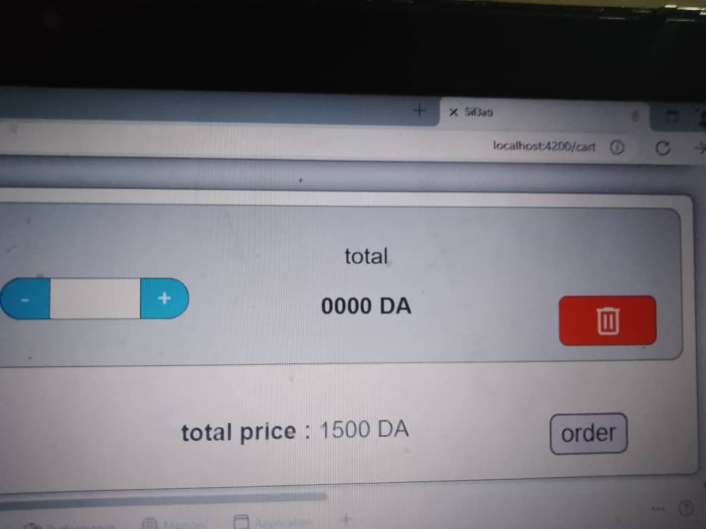
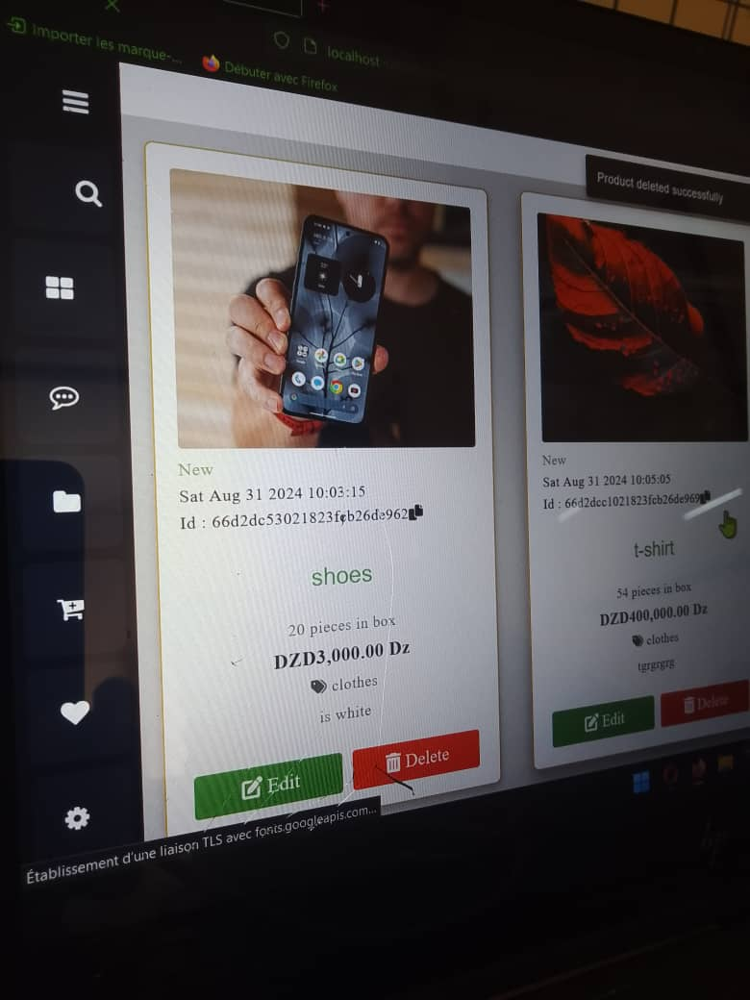

# 🛒 Full-Stack E-Commerce Platform

A comprehensive, production-ready Full-Stack e-commerce web application that delivers a seamless shopping experience for customers while providing robust management tools for store administrators.

## ✨ Key Features

### 🛍️ Customer Experience
- **Product Discovery:** Browse products dynamically by categories with advanced search and filtering options.
- **Cart & Wishlist:** Fully functional shopping cart and wishlist systems to manage items before purchasing.
- **Checkout System:** Secure checkout simulation with shipping details management and order summary.
- **Responsive Design:** Optimized for all screen sizes, from mobile devices to desktop monitors.

## 🛠️ Tech Stack

- **Frontend:** HTML5, CSS3, JavaScript ( framework used Angular )
- **Backend:**  Node.js 

## photos

## 🚀 Getting Started

### Prerequisites
Make sure you have the following installed on your machine:
- Node.js & npm 
- Database Server 

- This project was generated with [Angular CLI](https://github.com/angular/angular-cli) version 18.1.3.

## Development server

Run `ng serve` for a dev server. Navigate to `http://localhost:4200/`. The application will automatically reload if you change any of the source files.

## Code scaffolding

Run `ng generate component component-name` to generate a new component. You can also use `ng generate directive|pipe|service|class|guard|interface|enum|module`.

## Build

Run `ng build` to build the project. The build artifacts will be stored in the `dist/` directory.

## Running unit tests

Run `ng test` to execute the unit tests via [Karma](https://karma-runner.github.io).

## Running end-to-end tests

Run `ng e2e` to execute the end-to-end tests via a platform of your choice. To use this command, you need to first add a package that implements end-to-end testing capabilities.

## Further help

To get more help on the Angular CLI use `ng help` or go check out the [Angular CLI Overview and Command Reference](https://angular.dev/tools/cli) page.
"E-commerce web application" 

